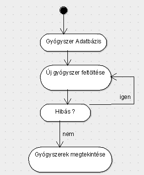

## **Gyógyszertár Adatbázis**

Készítette: Enyingi Károly

### **1. Követelményanalízis**

##### **1.1. Célkitűzés, projektindító dokumentum**

A program legfőbb célja jól átláthatóan, és érthetően megjeleníteni az adott gyógyszerek főbb tulajdonságait, és hatóanyagaikat egy webes vastagkliens, azaz egyoldali alkalmazás felhasználásával Az adatok védelme érdekében legyen lehetőség regisztrációra, majd bejelentkezésre. Bejelentkezett felhasználó a gyógyszerek listáját megtekintheti, bővítheti, meglévő elemeket törölhet, valamit megjegyzéseket írhat.

###### **Funkcionális követelmények:**

- Regisztrációra
- Bejelentkezés
- Csak bejelentkezett felhasználók által elérhető funkciók
  - új gyógyszer felvételére a listába
  - a meglévő gyógyszerek szerkesztésére
  - a meglévő gyógyszerek törlésére

###### **Nem funkcionális követelmények:**

- **Könnyű áttekinthetőség:** Színekkel típus szerint csoportosítás
- **Használhatóság:** Könnyű áttekinthetőség, ésszerű elrendezés, könnyen kezelhetőség
- **Megbízhatóság:** jelszóval védett funkciók, és a jelszavak védelme a háttérben. Hibásan bevitt adatok esetén a program jól láthatóan jelezzen a felhasználónak, és emelje ki a hibás beviteli mezőket. A jól bevitt adatok maradjanak az űrlapban.
- **Karbantarthatóság:** könnyen lehessen bővíteni, a különböző típusú fájlok külön csoportosítva, ésszerűen legyenek felbontva, a könnyebb fejleszthetőség miatt

##### **1.2. Szakterületi fogalomjegyzék**

**Fajták:**

- **Védőoltás:** gyöngített vagy elölt kórokozókat, azok részeit vagy kész ellenanyagot tartalmazó készítmény.
- **Immunerősítő:** olyan készítmények, amelyek a beteg immunrendszerét fokozza.
- **Influenza:** olyan gyógyszerek, amelyek segítenek a szezonális influenza leküzdésében.
- **Légúti megbetegedés:** olyan gyógyhatású készítmény, ami enyhíti a légúti megbetegedések tüneteit.

##### **1.3. Használatieset-modell, funkcionális követelmények**

**Vendég** : Csak a publikus oldalakat éri el

- Főoldal
- Bejelentkezés
- Regisztráció

**Bejelentkezett felhasználó** : A publikus oldalak elérésén felül egyéb funkciókhoz is hozzáfér.

- Új gyógyszer felvétele
- Meglévő gyógyszer megtekintése
- Meglévő gyógyszer szerkesztése
- Meglévő gyógyszer törlése

Vegyünk példának egy egyszerű folyamatot:

**Meglévő gyógyszer szerkesztése:**

1. A felhasználó az oldalra érkezve, bejelentkezik vagy regisztrál
2. Regisztráció után megtekintheti a gyógyszereket listázó oldalt, ahol kiválaszthatja a szerkeszteni kívánt gyógyszert.
3. Megnyomja a szerkesztés feliratú gombot
4. Szerkesztés oldalon felviszi az új adatokat
5. Módosít gombra kattintva elmenti a változásokat

**Regisztráció**

**Bejelentkezés**

**Gyógyszer feltöltése**

### 2. Tervezés

###### **2.1.2. Oldaltérkép:**

**Publikus:**

- Főoldal
- Bejelentkezés
- Regisztráció

**Bejelentkezett:**

- Főoldal
- Új gyógyszer felvétele
- Listaoldal
  - Gyógyszer törlése
  - Gyógyszer megtekintése
    - Gyógyszer szerkesztése

###### **2.1.3. Végpontok**

- GET/: főoldal
- GET/login: bejelentkező oldal
- POST/login: bejelentkező adatok felküldése
- GET/register: regisztrációs oldal
- POST/register: regisztrációs adatok felküldése
- GET/logout: kijelentkező oldal

- GET/ownMedicines: gyógyszerlista oldal
- GET/medicines/create: új gyógyszer felvétele
- POST/medicines/create: új gyógyszer felvételéhez szükséges adatok felküldése
- GET/medicines/:id: gyógyszer adatok
- POST/medicines/:id/edit: gyógyszer módosítása, adatok felküldése
- GET/medicines/:id/delete: gyógyszer törlése
- GET/medicines/:id/edit: gyógyszer módosítása
- POST/medicines/:id: gyógyszer módosítása, adatok felküldése

##### **2.2. Felhasználói-felület modell**

###### **2.2.1.Oldalvázlato:**

**Főoldal**

**Regisztrációs oldal**

**Bejelentkező oldal**

######2.2.2.Designtervek (végső megvalósítás kinézete):

**Guest**

**Guest2**

**Signup**

**Login**

**New**

**Edit**

######2.2.3. Osztálymodell
 
 **Adatmodell**
 
 
 
 **Adatbázisterv**
 
 
 
######2.2.4.  Dinamikus működés

 **Szekvenciadiagram**
 
 Vegyünk példának a regisztrációt, majd egy új elem felvételét, szerkesztését, törlését, mindezt szekvenciadiagrammon.
 
 
 
###3.	Implementáció

######3.1.1. Fejlesztőkörnyezet

Webes IDE: **ADONIS**

#####4.4.Tesztesetek
* User
  * Felhasználó létrehozása
  * Felhasználó keresése
  * Felhasználó módosítása
  * Bejelentkezés jó, és rossz jelszóval
  * Medicine
  * Főoldal láthatósága
  * Új gyógyszer feltöltése oldal láthatósága
  * Csak bejelentkezett felhasználó által látható oldal láthatósága
  * Sikeres bejelentkezés

  
###5.	Felhasználói dokumentáció

**Futtatáshoz szükséges operációs rendszer:** Tetszőleges operációs rendszer

**A futtatáshoz szükséges hardver:** Operációs rendszerek szerint megadva

**Egyéb követelmények:** Internet böngésző telepítése, JavaScript ajánlott

**Program használata:**

1. Böngészőben nyissuk meg a főoldalt
2. Jobb felső sarokban kattintsunk a Belépés feliratra
3. Belépés/Regisztráció után hozzáférünk jogokhoz.
4. Gyógyszer feltöltése gombra kattintva tudunk új gyógyszereket felvenni a listába
5. Töltsük ki az űrlapot
6. Hibás adatok esetén az űrlap jelezni fogja a hibát
7. Gyógyszer feltöltése gombra kattintva mentsük el az adatokat
8. A gyógyszer oldalán: Törlés gombra kattintva törölhetjük a gyógyszert
9. A gyógyszer oldalán: szerkeszt gombra kattintva a szerkesztés oldalra jutunk

###6.	Irodalomjegyzék:

http://webprogramozas.inf.elte.hu/alkfejl.php

http://ade.web.elte.hu/wabp/lecke2_lap1.html

http://webprogramozas.inf.elte.hu/alkfejl/A_dokumentacio_felepitese.pdf
